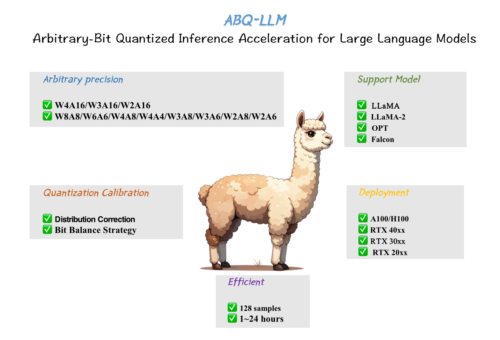
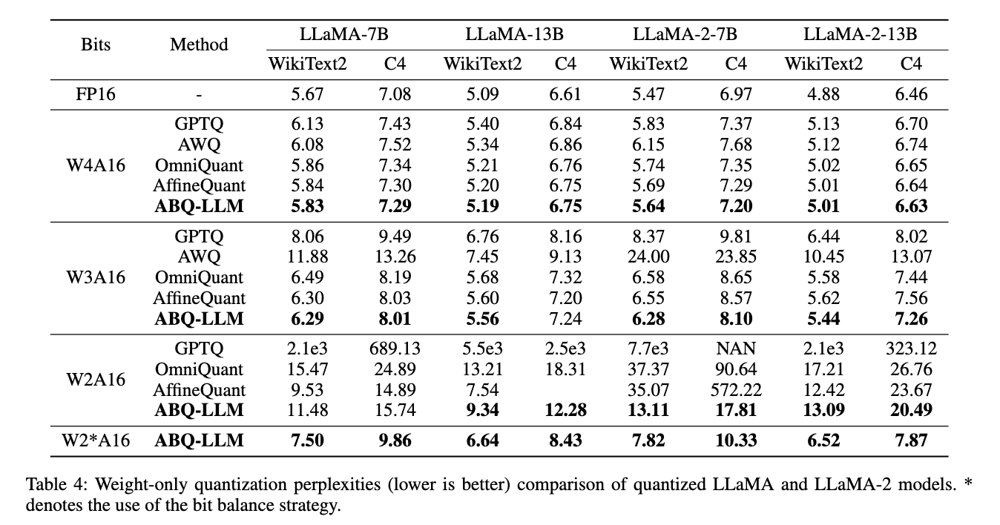
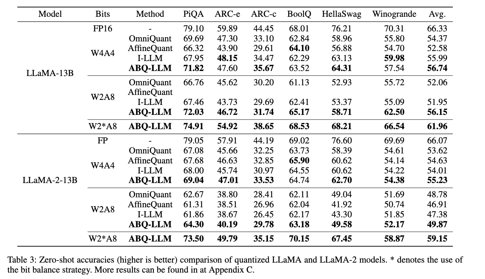
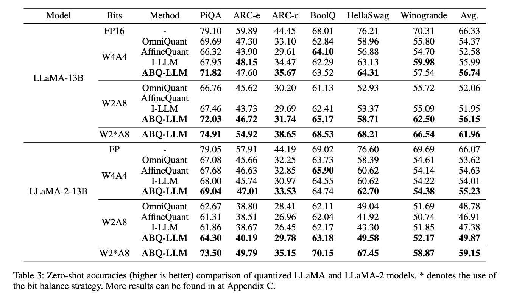
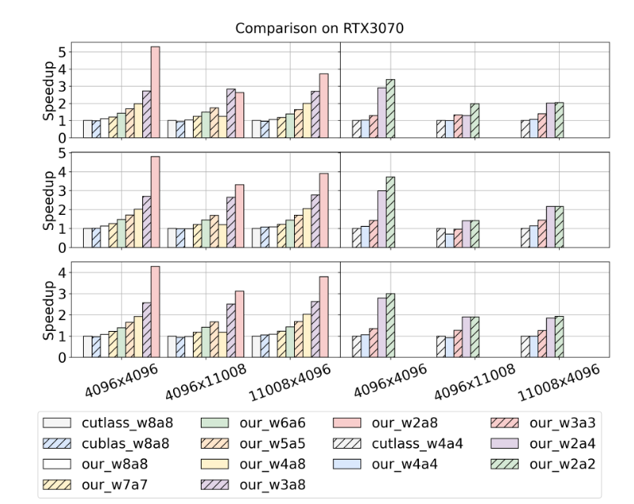

# ABQ-LLM: Arbitrary-Bit Quantized Inference Acceleration for Large Language Models


ABQ-LLM is a novel arbitrary bit quantization scheme that achieves excellent performance under various quantization settings while enabling efficient arbitrary bit computation at the inference level. The current release version supports the following features:

- The ABQ-LLM algorithm is employed for precise weight-only quantization (W8A16, W4A16, W3A16, W2A16) and weight-activation quantization (W8A8, W6A6, W4A4, W3A8, W3A6, W2A8, W2A6).
- Pre-trained ABQ-LLM model weights for LLM (LLaMA and LLaMA-2 loaded to run quantized models).
- A set of out-of-the-box arbitrary bit quantization operators that support arbitrary bit model inference in Turing and above architectures.


## Contents
- [Install](#install)
<<<<<<< HEAD
- [Model Zoo](#abq-llm-model-zoo)
=======
- [ABQ-LLM Model](#abq-llm-model)
>>>>>>> abd8f796e12e91eb5f4212e54edf1c346e247c0c
- [Usage](#usage)
- [Results](#results)
- [Citation](#citation)

## Install
Installation of the algorithmic runtime environment
```
conda create -n abq-llm python=3.10.0 -y
conda activate abq-llm
git clone https://github.com/bytedance/ABQ-LLM.git
cd ./ABQ-LLM/algorithm
pip install --upgrade pip 
pip install -r requirements.txt
```

Installation of the engine reasoning environment
```

```


## ABQ-LLM Model
We provide pre-trained ABQ-LLM model zoo for multiple model families, including LLaMa-1&2, OPT.
The detailed support list:
| Models  | Sizes                           | W4A16 | W3A16 | W2A16 | W2A16g128 | W2A16g64|
| ------- | ------------------------------- | ----- | --------- | -------- | ----- |----- |
| LLaMA   | 7B/13B  | ✅     | ✅         | ✅        | ✅     |✅     |
| LLaMA-2 | 7B/13B  | ✅     | ✅         | ✅        | ✅     |✅     |


| Models       | Sizes                           | W8A8 | W4A8 | W6A6 | W4A6 | W4A4 | W3A8 | W3A6 | W2A8 | W2A6 |
| ------------ | ------------------------------- | --------- | ----- | --------- | ---- | ---- |---- |---- |---- |---- |
| LLaMA        | 7B/13B                  | ✅         | ✅     | ✅         | ✅    | ✅    | ✅    | ✅    | ✅    |✅    |
| LLaMA-2      | 7B/13B                     | ✅         | ✅     | ✅         | ✅    | ✅    | ✅    | ✅    | ✅    |✅    |


## Usage
We provide the pre-trained ABQ- LLM model weight in hugginface, you can verify the model performance by the following commands.
```
CUDA_VISIBLE_DEVICES=0 python run_pretrain_abq_model.py \
--model /PATH/TO/LLaMA/llama-7b-ABQ \
--wbits 4 --abits 4
```

**We also provide full script to run ABQ-LLM in `./algorithm/scripts/`**. We use LLaMa-7B as an example here:
1. Obtain the channel-wise scales and shifts required for initialization:
```
python generate_act_scale_shift.py --model /PATH/TO/LLaMA/llama-7b
```

2. Weight-only quantization
```
# W3A16
CUDA_VISIBLE_DEVICES=0 python main.py \
--model /PATH/TO/LLaMA/llama-7b  \
--epochs 20 --output_dir ./log/llama-7b-w3a16 \
--eval_ppl --wbits 3 --abits 16  --lwc --let

# W3A16g128
CUDA_VISIBLE_DEVICES=0 python main.py \
--model /PATH/TO/LLaMA/llama-7b  \
--epochs 20 --output_dir ./log/llama-7b-w3a16g128 \
--eval_ppl --wbits 3 --abits 16 --group_size 128 --lwc --let
```

3. weight-activation quantization
```
# W4A4
CUDA_VISIBLE_DEVICES=0 python main.py \
--model /PATH/TO/LLaMA/llama-7b  \
--epochs 20 --output_dir ./log/llama-7b-w4a4 \
--eval_ppl --wbits 4 --abits 4 --lwc --let \
--tasks piqa,arc_easy,arc_challenge,boolq,hellaswag,winogrande
```

More detailed and optional arguments:
- `--model`: the local model path or huggingface format.
- `--wbits`: weight quantization bits.
- `--abits`: activation quantization bits.
- `--group_size`: group size of weight quantization. If no set, use per-channel quantization for weight as default.
- `--lwc`: activate the Learnable Weight Clipping (LWC).
- `--let`: activate the Learnable Equivalent Transformation (LET).
- `--lwc_lr`: learning rate of LWC parameters, 1e-2 as default.
- `--let_lr`: learning rate of LET parameters, 5e-3 as default.
- `--epochs`: training epochs. You can set it as 0 to evaluate pre-trained OmniQuant checkpoints.
- `--nsamples`: number of calibration samples, 128 as default.
- `--eval_ppl`: evaluating the perplexity of quantized models.
- `--tasks`: evaluating zero-shot tasks.
- `--resume`: loading pre-trained OmniQuant parameters.
- `--multigpu`: to inference larger network on multiple GPUs
- `--real_quant`: real quantization, which can see memory reduce. Note that due to the limitations of AutoGPTQ kernels, the real quantization of weight-only quantization can only lead memory reduction, but with slower inference speed.
- `--save_dir`: saving the quantization model for further exploration.


## Results
- ABQ-LLM achieve SoTA performance in weight-only quantization

- ABQ-LLM achieve SoTA performance in weight-activation quantization

- ABQ-LLM achieve SoTA performance in zero-shot task

- On kernel inference acceleration, ABQ- LLM achieves performance gains that far exceed those of CUTLASS and CUBLAS.


## Related Project
[SmoothQuant: Accurate and Efficient Post-Training Quantization for Large Language Models](https://github.com/mit-han-lab/smoothquant)

[AWQ: Activation-aware Weight Quantization for LLM Compression and Acceleration](https://github.com/mit-han-lab/llm-awq)

[GPTQ: Accurate Post-training Compression for Generative Pretrained Transformers](https://github.com/IST-DASLab/gptq)

[RPTQ: Reorder-Based Post-Training Quantization for Large Language Models](https://github.com/hahnyuan/RPTQ4LLM)

[OmniQuant is a simple and powerful quantization technique for LLMs](https://github.com/OpenGVLab/OmniQuant)


## Citation
If you use our ABQ-LLM approach in your research, please cite our paper:
```
@article{
}
```
